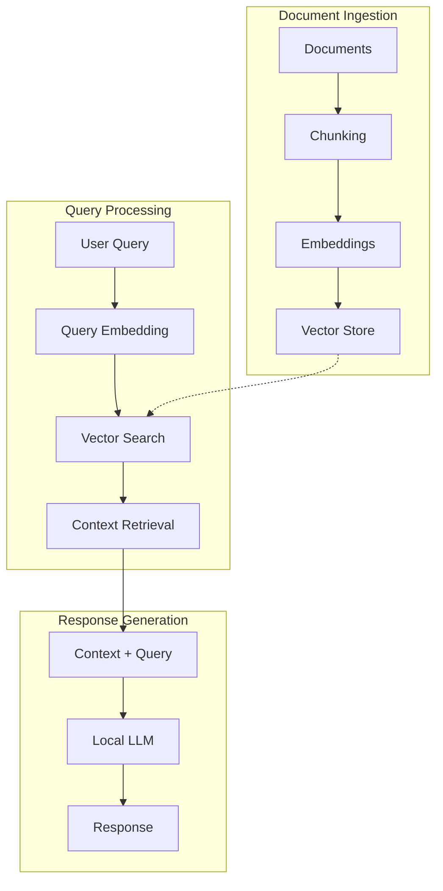

# 🏗️ Architecture: Local RAG System

## System Overview



## Component Architecture

### Core Components

```
python_example/
├── src/
│   ├── rag_pipeline_local.py   # Main orchestrator
│   ├── vector_store_lancedb.py # Vector storage
│   ├── embeddings_local.py     # Text embeddings
│   ├── llm_local.py            # LLM generation
│   └── chunking.py             # Document processing
```

## Deployment Scenarios

### Scenario 1: Personal Desktop (Most Common)

**Hardware Requirements:**
- CPU: 4+ cores
- RAM: 8-16GB
- Storage: 20GB SSD
- GPU: Optional (speeds up inference)

**Configuration:**
```python
rag = LocalRAGPipeline(
    llm_model="mistral:latest",        # 7B model
    embedding_model="nomic-embed-text:latest",
    chunk_size=512,
    use_sentence_transformers=False
)
```

**Performance:**
- Embedding: ~0.2s/doc
- Search: <0.05s
- Generation: 2-5s
- Total query: 3-6s

### Scenario 2: High-Performance Workstation

**Hardware Requirements:**
- CPU: 8+ cores
- RAM: 32GB+
- Storage: 100GB NVMe SSD
- GPU: NVIDIA RTX 3060+ or Apple M1+

**Configuration:**
```python
rag = LocalRAGPipeline(
    llm_model="mixtral:8x7b",          # MoE model
    embedding_model="mxbai-embed-large",
    chunk_size=1024,
    chunk_overlap=100
)

# Enable GPU acceleration
llm = LlamaCppLLM(
    model_path="models/mixtral.gguf",
    n_gpu_layers=35  # Offload to GPU
)
```

**Performance:**
- Embedding: ~0.1s/doc
- Search: <0.02s
- Generation: 1-3s
- Total query: 2-4s

### Scenario 3: Lightweight Laptop

**Hardware Requirements:**
- CPU: 2+ cores
- RAM: 4-8GB
- Storage: 10GB
- GPU: Not required

**Configuration:**
```python
# Use sentence transformers (no Ollama needed)
rag = LocalRAGPipeline(
    llm_model="phi",                   # 2.7B model
    embedding_model="all-MiniLM-L6-v2",
    chunk_size=256,
    use_sentence_transformers=True
)
```

**Performance:**
- Embedding: ~0.1s/doc
- Search: <0.1s
- Generation: 5-10s
- Total query: 6-12s

### Scenario 4: Server/Docker Deployment

**Hardware Requirements:**
- CPU: 8+ cores
- RAM: 16GB+
- Storage: 50GB
- GPU: Optional

**Docker Compose Configuration:**
```yaml
version: '3.8'

services:
  ollama:
    image: ollama/ollama:latest
    ports:
      - "11434:11434"
    volumes:
      - ollama_data:/root/.ollama
    deploy:
      resources:
        limits:
          memory: 8G
    command: serve

  rag-api:
    build: .
    ports:
      - "8000:8000"
    environment:
      - OLLAMA_BASE_URL=http://ollama:11434
      - LANCEDB_DATA_DIR=/data/lancedb
    volumes:
      - ./data:/data
    depends_on:
      - ollama

volumes:
  ollama_data:
```

**API Configuration:**
```python
# FastAPI wrapper for RAG
from fastapi import FastAPI
from src.rag_pipeline_local import LocalRAGPipeline

app = FastAPI()
rag = LocalRAGPipeline()

@app.post("/query")
async def query(text: str):
    response = rag.query(text)
    return {"answer": response.answer, "sources": response.sources}
```

### Scenario 5: Edge Device (Raspberry Pi)

**Hardware Requirements:**
- CPU: ARM64 4+ cores
- RAM: 4-8GB
- Storage: 32GB SD card
- GPU: Not applicable

**Configuration:**
```python
# Ultra-lightweight setup
rag = LocalRAGPipeline(
    llm_model=None,  # Use only retrieval
    embedding_model="all-MiniLM-L6-v2",
    chunk_size=128,
    use_sentence_transformers=True
)

# Retrieval-only mode
def retrieve_only(query):
    results = rag.vector_store.search(query, top_k=3)
    return results  # Return relevant chunks without generation
```

## Data Flow Architecture

### 1. Document Ingestion Pipeline

```python
Documents
    ↓
TextChunker/MarkdownChunker
    ├── chunk_size: 512
    ├── chunk_overlap: 50
    └── separators: ["\n\n", "\n", ". ", " "]
    ↓
Embeddings (OllamaEmbeddings/SentenceTransformers)
    ├── model: nomic-embed-text
    ├── dimensions: 768
    └── cache: ./data/embedding_cache/
    ↓
LanceDBVectorStore
    ├── storage: ./data/lancedb/
    ├── index: IVF-PQ
    └── schema: dynamic
```

### 2. Query Processing Pipeline

```python
User Query
    ↓
Query Embedding
    ├── same model as documents
    └── cached if repeated
    ↓
Vector Search
    ├── metric: L2/cosine
    ├── top_k: 5
    └── hybrid: optional
    ↓
Context Assembly
    ├── ranked by similarity
    └── metadata included
```

### 3. Response Generation Pipeline

```python
Context + Query
    ↓
Prompt Template
    ├── system_prompt: customizable
    ├── context: retrieved chunks
    └── query: user question
    ↓
Local LLM (Ollama)
    ├── model: mistral/llama2/mixtral
    ├── temperature: 0.7
    └── max_tokens: 1000
    ↓
Response
    ├── answer: generated text
    ├── sources: chunk references
    └── metadata: timing, model
```

## Storage Architecture

### File System Layout

```
data/
├── lancedb/              # Vector database
│   ├── documents.lance/  # Main collection
│   └── _versions/        # Version history
├── embedding_cache/      # Cached embeddings
│   └── *.json           # MD5-named cache files
├── models/              # Optional local models
│   └── *.gguf          # Quantized models
└── logs/               # Application logs
```

### Database Schema

**LanceDB Table Structure:**
```python
{
    "id": str,           # UUID
    "text": str,         # Original chunk text
    "vector": List[float],  # Embedding vector
    "metadata": str,     # JSON metadata
    "timestamp": datetime  # Creation time
}
```

## Performance Optimization

### 1. Caching Strategy

```python
# Three-tier caching
L1: In-memory LRU cache (recent queries)
L2: Embedding cache (disk-based)
L3: LanceDB built-in caching
```

### 2. Batching Strategy

```python
# Document batching
BATCH_SIZE = 100  # Documents per batch
EMBEDDING_BATCH = 32  # Parallel embeddings
SEARCH_BATCH = 10  # Concurrent searches
```

### 3. Index Configuration

```python
# ANN Index for fast search
index_config = {
    "type": "IVF_PQ",
    "num_partitions": 256,
    "num_sub_vectors": 96,
    "metric": "L2",
    "nprobes": 20
}
```

## Scaling Architecture

### Horizontal Scaling

```python
# Multiple RAG instances with shared storage
instances = []
for i in range(num_workers):
    rag = LocalRAGPipeline(
        collection_name=f"worker_{i}",
        shared_cache=True
    )
    instances.append(rag)

# Load balancer
def route_query(query):
    worker = hash(query) % num_workers
    return instances[worker].query(query)
```

### Vertical Scaling

```python
# GPU acceleration
if torch.cuda.is_available():
    device = "cuda"
    n_gpu_layers = 35
elif torch.backends.mps.is_available():
    device = "mps"
    n_gpu_layers = 1
else:
    device = "cpu"
    n_gpu_layers = 0
```

## Security Architecture

### Data Privacy

```python
# All data stays local
- No external API calls
- No telemetry
- No cloud storage
- Encrypted cache (optional)
```

### Access Control

```python
# Simple authentication wrapper
from functools import wraps

def require_auth(f):
    @wraps(f)
    def decorated(*args, **kwargs):
        # Check local auth token
        if not verify_token():
            raise Unauthorized()
        return f(*args, **kwargs)
    return decorated
```

## Monitoring Architecture

### Metrics Collection

```python
metrics = {
    "queries_per_second": 0,
    "avg_response_time": 0,
    "cache_hit_rate": 0,
    "documents_indexed": 0,
    "storage_used_gb": 0
}
```

### Health Checks

```python
def health_check():
    checks = {
        "ollama": check_ollama_service(),
        "lancedb": check_vector_store(),
        "disk_space": check_disk_space(),
        "memory": check_memory_usage()
    }
    return all(checks.values())
```

## Deployment Patterns

### 1. Standalone Application
- Single user
- Desktop GUI
- Local storage

### 2. API Service
- Multiple users
- REST/GraphQL API
- Shared storage

### 3. Embedded System
- IoT devices
- Edge computing
- Minimal resources

### 4. Distributed System
- Multiple nodes
- Load balancing
- Fault tolerance

## Technology Stack

### Core Technologies
- **Python 3.9+**: Main language
- **Ollama**: LLM inference
- **LanceDB**: Vector storage
- **PyArrow**: Data processing
- **Sentence Transformers**: Embeddings

### Optional Technologies
- **FastAPI**: API framework
- **Docker**: Containerization
- **Redis**: Additional caching
- **PostgreSQL**: Metadata storage
- **Nginx**: Reverse proxy

## Best Practices

1. **Model Selection**: Choose based on available RAM
2. **Chunk Size**: Adjust based on document type
3. **Caching**: Enable for production use
4. **Indexing**: Create after bulk ingestion
5. **Monitoring**: Track performance metrics
6. **Backup**: Regular LanceDB backups
7. **Updates**: Keep Ollama models updated

## Future Architecture Considerations

### Planned Enhancements
- Multi-modal support (images, audio)
- Streaming responses
- Real-time document updates
- Federated learning
- Model fine-tuning

### Potential Integrations
- Langchain compatibility
- LlamaIndex support
- Gradio UI
- Streamlit dashboard
- Jupyter integration

---

**Key Insight**: This architecture prioritizes **zero cost**, **complete privacy**, and **maximum flexibility** while maintaining production-grade performance. Every design decision supports these goals.